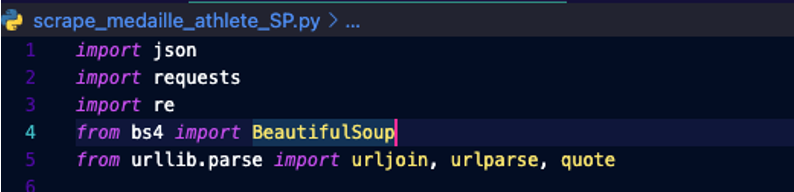
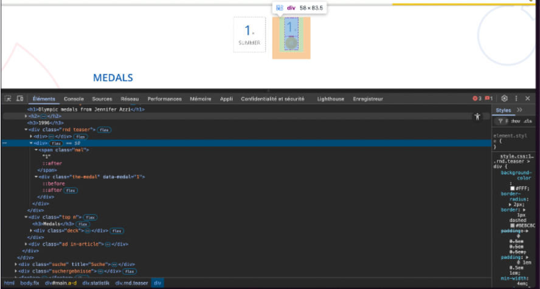
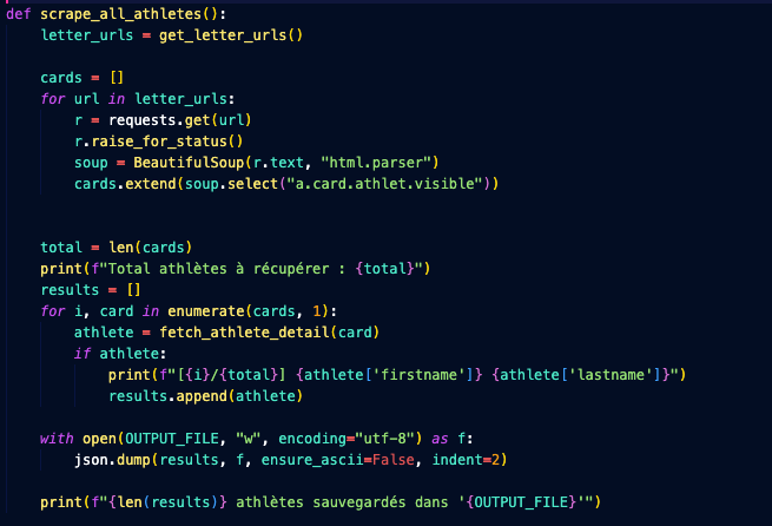
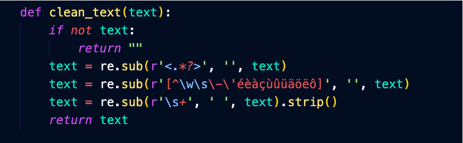
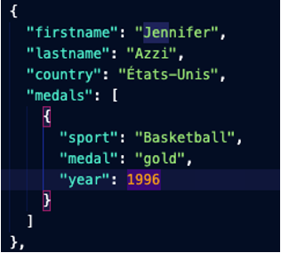
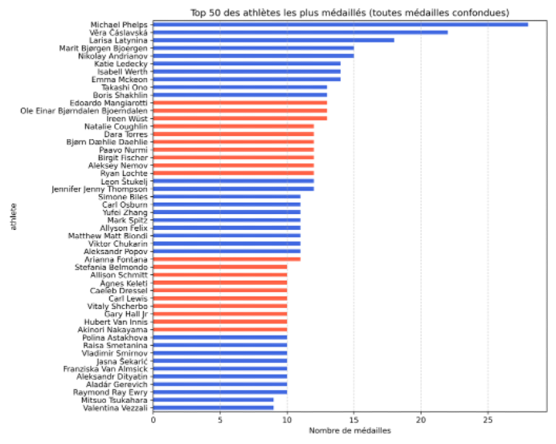
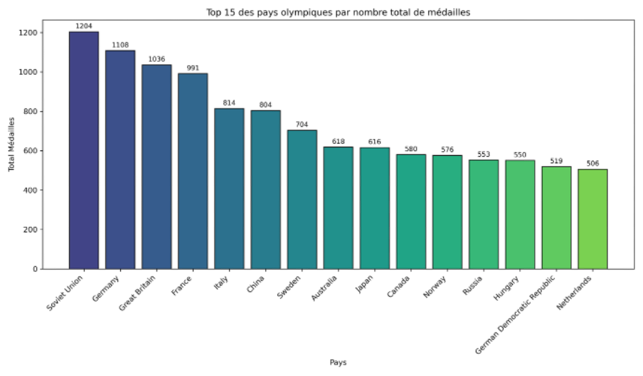
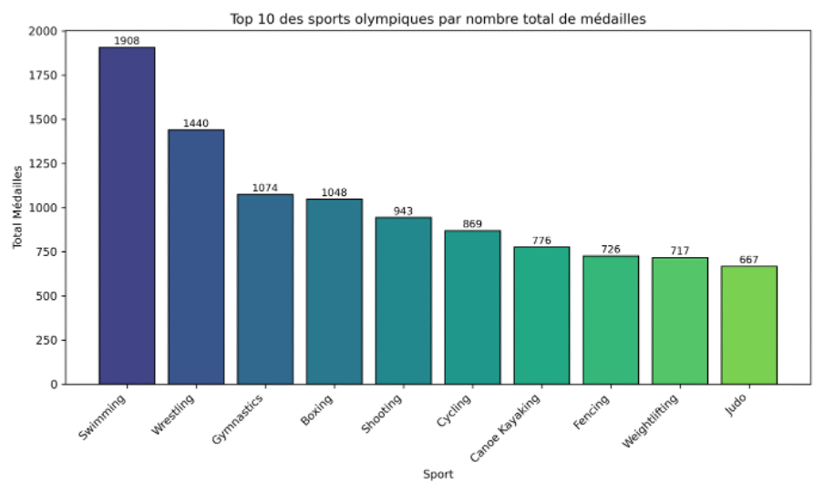

# projetDataViz
 Pour effectuer le scraping, lancez les scripts `scrape_medaille_athlete_P.py`,`scrape_medaille_athlete_SP.py`, `scrape_medaille_pays.py` et `scrape_medaille_sport.py`. Les fichiers JSON seront créés dans le dossier `json`.

Pour afficher les visualisations, lancez les scripts `visu_athlete.py`, `visu_pays.py` et `visu_sport.py`. Les graphiques seront générés au format PNG dans le dossier `png`.
## Prérequis

* Python 3.7 ou supérieur

##  Description des scripts

* **scrape\_medaille\_athlete\_P.py**
  Scraping des athlètes (version Proxy) et export JSON.

* **scrape\_medaille\_athlete\_SP.py**
  Variante du scraping athlète (version Sans Proxy).

* **scrape\_medaille\_pays.py**
  Scraping des médailles agrégées par pays.

* **scrape\_medaille\_sport.py**
  Scraping des médailles agrégées par sport.

* **visu\_athlete.py**
  Génère le graphique des meilleurs athlètes.

* **visu\_pays.py**
  Génère le graphique des pays les plus médaillés.

* **visu\_sport.py**
  Génère le graphique des sports les plus médaillés.

## Dépendances

Ce projet utilise les bibliothèques Python suivantes pour les visuels  :

* `json` (intégrée)
* `pandas`
* `numpy`
* `matplotlib`
et pour les scrapper jutilise les bibliotheque suivante : 

* `json` (intégrée)
* `re` (intégrée)
* `time` (intégrée)
* `random` (intégrée)
* `concurrent.futures` (intégrée)
* `urllib.parse` (intégrée)
* `requests`
* `beautifulsoup4` (pour `bs4`)


## Installation

Exécutez la commande suivante pour installer les dépendances pour les visuels :

```bash
pip install pandas numpy matplotlib
```

Exécutez la commande suivante pour installer les dépendances pour les scrapper :
```bash
pip install requests beautifulsoup4 
```


## Utilisation

Pour lancer le script de scraping :

```bash
python scrape_medaille_athlete_P.py
python scrape_medaille_athlete_SP.py
python scrape_medaille_pays.py
python scrape_medaille_sport.py
```
Les résultats seront dans `json/`.

```bash
python visu_athlete.py
python visu_pays.py
python visu_sport.py
```
Les résultats seront dans `png/`.

## Structure du projet

```
├── json/                          # Répertoire de sortie des fichiers JSON
│   ├── country_codes.json        # Codes pays pour la normalisation
│   ├── medaille_athlete.json     # Résultat du scraping pour les athlètes
│   ├── medaille_pays.json        # Résultat du scraping par pays
│   ├── medaille_sport.json       # Résultat du scraping par sport
│   └── nations_list.json         # Liste des nations
├── png/                           # Graphiques générés
│   ├── top_medaille_athletes.png  # Top athlètes
│   ├── top_medaille_pays.png      # Top pays
│   └── top_medaille_sport.png     # Top sports
├── proxies.txt                    # Liste des proxies
├── README.md                      # Documentation du projet
├── scrape_medaille_athlete_P.py   # Script de scraping des athlètes (version P)
├── scrape_medaille_athlete_SP.py  # Script de scraping des athlètes (version SP)
├── scrape_medaille_pays.py        # Script de scraping par pays
├── scrape_medaille_sport.py       # Script de scraping par sport
├── visu_athlete.py                # Visualisation des données athlètes
├── visu_pays.py                   # Visualisation des données pays
└── visu_sport.py                  # Visualisation des données par sport
```


## Licence

Indiquez la licence de votre projet (MIT, Apache 2.0, etc.).


## Rapport 


Essayah Charaf
M1 DE 
DATA VIZ 
Cyril VIMARD


Table des matières
INTRODUCTION	3
COLLECTE & EXTRACTION DES DONNEES	3
NETTOYAGE & STRUCTURATION (JSON)	5
STRUCTURE DU FICHIER JSON	6
VISUALISATIONS (3 GRAPHIQUES)	6
DEPLOIEMENT	8


# Introduction
Dans le cadre d’un projet d’exploitation et de visualisation des données, j’ai extrait, nettoyé et structuré des informations relatives aux Jeux Olympiques à partir du site https://olympics-statistics.com/home.
Ce rapport couvre :
•	l’extraction par scraping des athlètes (nom, prénom, pays, genre) et de leur palmarès,
•	le recensement du nombre de médailles (or, argent, bronze) par pays,
•	l’obtention de la répartition des médailles par discipline et par pays,
•	l’export des données nettoyées au format JSON,
•	la création de trois visualisations (palmarès des athlètes, bilan médaille par pays, répartition par sport).

# Collecte & extraction des données
Pour la collecte et l’extraction, j’ai choisi le language Python, complété par des bibliothèques dédiées (requests, BeautifulSoup,time, re et json) pour récupérer, nettoyer et enregistrer les informations des Jeux Olympiques au format JSON.
•	requests pour charger les pages web
•	BeautifulSoup (bs4) pour parser le HTML et extraire les balises
•	re pour nettoyer le texte
•	json pour générer les fichiers de sortie
•	time (sleep) pour espacer les requêtes et éviter de surcharger le serveur



Chaque script démarre d’une URL de base, envoie une requête, analyse le DOM avec BeautifulSoup, récupère les informations (athlètes, pays, sports), nettoie les résultats et les enregistre en JSON.



Avant de lancer le scraping, j’ai d’abord inspecté le code HTML du site pour repérer les balises et classes contenant les informations essentielles (athlètes, disciplines, pays). J’ai étudié les modèles d’URL menant aux fiches détaillées et aux pages par discipline ou par pays, et j’ai identifié les éventuelles difficultés (liens relatifs, pagination, variations de structure entre les pages). Cette analyse préalable m’a permis de concevoir des scripts plus robustes et d’anticiper les cas particuliers avant d’extraire les données.

En examinant le code HTML, j’ai repéré que pour chaque médaille :
•	Le nombre de médailles est dans un <span> (ici le « 1 »).
•	Juste à côté, la <div class="the-medal" data-medal="X"> indique le type :
o	data-medal="1" → or
o	data-medal="2" → argent
o	data-medal="3" → bronze
Grâce à cette structure, le scraper peut lire d’abord la valeur du <span> pour le nombre, puis récupérer l’attribut data-medal pour savoir de quel medaille il s’agit.





Cette section du code récupère les informations de chaque athlète via BeautifulSoup, compile ces données grâce à fetch_athlete_detail() et les enregistre ensuite dans le fichier JSON (medaille_athlete.json).
# Nettoyage & structuration (JSON)


Cette petite fonction clean_text sert à normaliser une chaîne de caractères en trois étapes :
Suppression des balises HTML : elle retire tout ce qui est entre < et >.
Filtrage des caractères indésirables : elle ne conserve que les lettres (y compris accents), les chiffres, les espaces et le tiret.
Nettoyage des espaces : elle remplace les multiples espaces par un seul et supprime ceux en début et fin de chaîne.
Au final, on obtient un texte « propre », prêt à être analysé ou indexé.

 structure du fichier JSON


J’ai un fichier JSON décrivant Jennifer Azzi, citoyenne des États-Unis, avec son palmarès sportif : un tableau de médailles listant pour chaque compétition le sport (“Basketball”), la couleur de la médaille (“gold”) et l’année (1996).


# Visualisations (3 graphiques)








 
# Déploiement 
Le code ainsi que les visualisations sont disponibles dans le dépôt git ci-dessous :
https://github.com/charaaff/projetDataViz


